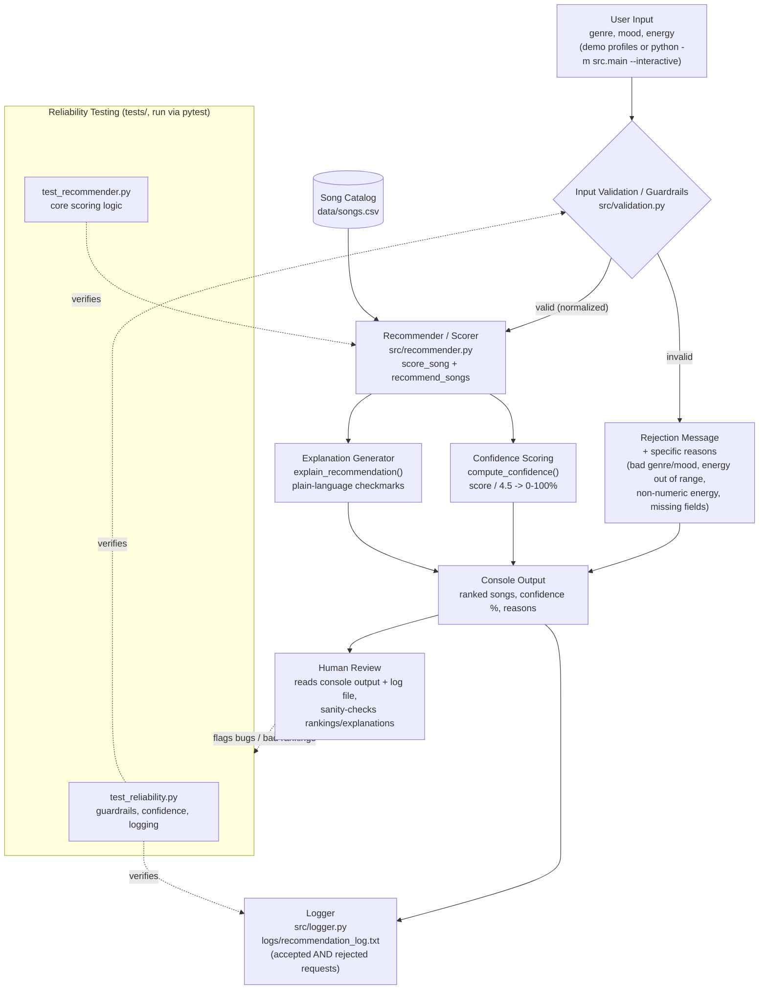

# 🎵 VibeFinder — Music Recommender Simulation

A small, fully-transparent content-based recommender with input guardrails, confidence scoring, human-readable explanations, and an automated reliability test suite.

---

## Original Project

**Music Recommender Simulation ("VibeFinder"),** built in Modules 1–3 of this course. The original goal was to represent songs and a listener's "taste profile" as plain data, design a transparent scoring rule that turns that data into ranked recommendations, and evaluate where the resulting system gets things right versus where it's biased. It shipped as a content-based recommender: given a small 18-song catalog and a user-stated profile (genre, mood, energy, and an acoustic preference), it scored every song against that profile and returned the top matches with a plain-language breakdown of the score — no listening history or collaborative filtering, just direct attribute comparison.

This repo extends that project with a **Reliability & Testing System**: input validation, confidence scoring, explanation generation, logging, error handling, and an automated test suite, all wired directly into the recommendation pipeline rather than bolted on as a side script.

---

## Summary

VibeFinder takes a genre/mood/energy profile and returns a ranked list of songs, each with a **confidence percentage** and a **plain-language explanation** of why it was picked — instead of a raw, uninterpretable score. Bad input (a genre not in the catalog, an energy value outside 0–1, a missing field) is caught by validation guardrails and rejected with a specific, actionable message rather than crashing the program or silently producing a nonsense ranking. Every request — accepted or rejected — is logged to disk, and a 6-test reliability suite verifies the guardrails, scoring, and logging all behave correctly.

Why this matters: any AI system that ranks or recommends things needs a way to (1) reject input it can't handle safely, (2) communicate how confident it is, (3) explain its reasoning, and (4) leave an audit trail. This project is a small, inspectable example of all four, built on top of a scoring rule simple enough that every part of the pipeline can be reasoned about by hand.

---

## Architecture Overview

The system is a straight `input → process → output` pipeline, with validation gating entry and a human/testing layer checking the result on both ends. Source of truth: [`diagrams/architecture.mmd`](diagrams/architecture.mmd).



**Components:**

- **Validator** (`src/validation.py`) — the guardrail. Derives valid genres/moods directly from `data/songs.csv` (so it can never drift out of sync with the data) and checks energy is a real number in `0.0–1.0`. Bad input never reaches the scorer.
- **Recommender / Scorer** (`src/recommender.py`) — the original additive scoring rule (genre + mood + energy + acousticness), unchanged in its core logic.
- **Confidence Scoring** (`compute_confidence()`) — normalizes the raw score into a 0–100% figure a non-technical user can read.
- **Explanation Generator** (`explain_recommendation()`) — turns the scoring breakdown into ✓/✗ plain-language bullets.
- **Logger** (`src/logger.py`) — append-only audit trail of every accepted recommendation and every rejected input.
- **Reliability Testing** (`tests/`) — `pytest` suite that verifies the validator, scorer, and logger independently of any single run.
- **Human Review** — the console output and log file are designed to be human-readable at a glance, so a person (not just a test) can sanity-check any given recommendation.

---

## How the Recommender Scores a Song

Each song is scored against a user profile with additive points, so it's always possible to see exactly which factor contributed how much:

```
score = 2.0 * genre_match       # 1 if song.genre == user.genre, else 0
      + 1.0 * mood_match        # 1 if song.mood == user.mood, else 0
      + 1.0 * energy_score      # 1 - abs(song.energy - user.energy), 0.0-1.0
      + 0.5 * acoustic_score    # song.acousticness, or 1 - it if user dislikes acoustic
```

Maximum possible score is **4.5** (perfect genre + mood + energy + acousticness match) — this is the denominator `compute_confidence()` divides by to get a percentage. Genre is weighted highest because a stated favorite genre is the most deliberate, explicit signal a user gives; acousticness is weighted lowest and acts more as a tiebreaker.

---

## Setup Instructions

1. **Create a virtual environment** (optional but recommended):

   ```bash
   python -m venv .venv
   source .venv/bin/activate      # Mac or Linux
   .venv\Scripts\activate         # Windows
   ```

2. **Install dependencies:**

   ```bash
   pip install -r requirements.txt
   ```

3. **Run the app:**

   ```bash
   python -m src.main
   ```

   This runs a starter profile plus a set of adversarial/edge-case profiles that exercise the guardrails, and writes every recommendation/rejection to `logs/recommendation_log.txt` (created automatically — no setup needed).

4. **Or run it interactively**, entering your own genre/mood/energy:

   ```bash
   python -m src.main --interactive
   ```

5. **Run the tests:**

   ```bash
   pytest
   ```

---

## Sample Interactions

**1. Valid input — high-confidence match**

Input: `genre=pop, mood=happy, energy=0.8`

```
1. Sunrise City by Neon Echo
   Confidence: 98%
   Why this recommendation?
     ✓ Genre matches Pop
     ✓ Mood matches Happy
     ✓ Energy is very similar (0.82 vs 0.80)

Recommendation logged successfully.
```

**2. Invalid genre — rejected by the guardrail**

Input: `genre=edm, mood=happy, energy=0.8`

```
Input rejected:
  - Invalid genre 'edm'. Choose one of: ambient, blues, classical, country, folk, house, indie pop, jazz, latin, lofi, metal, pop, r&b, rock, synthwave
```

**3. Energy out of range — rejected instead of silently mis-scored**

Input: `genre=pop, mood=happy, energy=1.5`

```
Input rejected:
  - Energy must be between 0 and 1, got 1.5.
```

**4. Case mismatch — now normalized instead of silently failing**

Input: `genre=Pop, mood=Happy, energy=0.8` (same real preferences as example 1, different capitalization)

```
1. Sunrise City by Neon Echo
   Confidence: 98%
   Why this recommendation?
     ✓ Genre matches Pop
     ✓ Mood matches Happy
     ✓ Energy is very similar (0.82 vs 0.80)
```

Before validation was added, this exact input returned a completely different (and wrong) top result, because genre/mood comparisons were case-sensitive — see [Testing Summary](#testing-summary).

---

## Design Decisions

- **Additive scoring over a normalized blend.** Each factor (genre +2.0, mood +1.0, energy up to +1.0, acousticness up to +0.5) contributes independently, so anyone reading the explanation can see exactly which factors drove a song's rank. The trade-off is that genre dominates the total (a genre match alone outweighs a perfect mood + energy match), which is a real, acknowledged bias rather than a hidden one — see [Limitations](#limitations).
- **Guardrails derived from the catalog, not a hardcoded list.** `validate_profile()` reads valid genres/moods from `data/songs.csv` at load time instead of a fixed set like `{"pop", "rock", "hip-hop", ...}`. The trade-off is one extra dependency (validation now needs the loaded catalog as an argument), but it means validation can never silently reject a genre that's actually in the data, or accept one that isn't.
- **Confidence as `score / max_possible_score`, clamped to [0, 1].** Simple and directly traceable back to the scoring recipe, at the cost of not being a calibrated probability — a 74% confidence doesn't mean "74% likely to be liked," only "74% of the maximum possible score."
- **Log both successes and failures.** `logs/recommendation_log.txt` records rejected input as well as accepted recommendations. This costs a bit of log verbosity, but means the log is also useful for debugging guardrail behavior later, not just for auditing what was recommended.
- **Kept exact-string matching for genre/mood** (fixing only case-sensitivity, not fuzzy matching). A more forgiving matcher (e.g., treating `"indie pop"` as partially matching `"pop"`) would soften the genre-dominance bias, but it would also make the scoring harder to explain in one line — I chose transparency over recall here, and documented the resulting brittleness instead of hiding it.
- **Validation and logging as separate modules** (`validation.py`, `logger.py`) rather than folded into `recommender.py` or `main.py`. Keeps each concern independently testable and means the core scoring logic wasn't touched to add reliability features.
- **Verified the weights weren't arbitrary by perturbing them.** As an experiment, I doubled the energy weight (1.0 → 2.0) and halved the genre weight (2.0 → 1.0) — the max score stayed 4.5 and `pytest` still passed, but the actual top-5 ranking for the starter profile changed (two songs swapped places). That confirmed the ranking is genuinely sensitive to these weights, not always dominated by genre regardless of their values, before committing to the original 2.0/1.0/1.0/0.5 split.

---

## Testing Summary

**What worked:** All 8 tests pass — the 2 original scoring tests plus 6 new reliability tests covering validation (valid input passes, invalid genre/empty mood/out-of-range energy are all rejected), end-to-end recommendation generation, and log-file writing.

```
8 tests executed
8 passed
```

Across the demo's valid profiles, the top recommendation's confidence averaged **0.86**, and every profile in the adversarial edge-case set (unknown genre, energy above 1 or below 0, a non-numeric energy string, a missing genre field, empty genre/mood strings) was rejected cleanly with a specific reason — none of them crashed the program.

**What didn't work initially:** Before adding guardrails, a missing `genre` key crashed the whole program with a `KeyError`; an energy value like `-0.5` produced a silently negative internal score with no floor; and `{"genre": "Pop", "mood": "Happy"}` scored as a total genre/mood mismatch purely because of capitalization, even though it represents the exact same preferences as `{"genre": "pop", "mood": "happy"}`. All three were only discoverable by deliberately probing the system with adversarial input — they didn't show up under normal use.

**What I learned:** Writing the reliability tests *before* trusting any given run surfaced a real correctness bug (the case-sensitivity issue) that had been sitting in the scoring logic the whole time, disguised as a "known limitation" in the original model card rather than recognized as a fixable bug. That was the clearest lesson here — a system can look correct in the profiles you happen to try and still be silently wrong for input you didn't think to test.

---

## Limitations

- Only 18 songs in the catalog, most genres/moods represented by a single song — rankings can flip based on very small scoring differences.
- Genre and energy are correlated in this dataset (high-energy genres are all rock/metal/pop/house; low-energy genres are all lofi/classical/folk/ambient), so a profile like "peaceful metal" can never get a real genre match and a real energy match at the same time.
- Genre/mood matching is still exact-string (case-insensitive now, but `"pop"` and `"indie pop"` are still unrelated to the scorer).
- No personalization or learning — every recommendation is stateless and based only on the stated profile, never on past feedback.

A deeper bias analysis, plus the graded responsible-AI reflection (how AI tools were used during development, one helpful and one flawed AI suggestion, and a fuller discussion of system limitations), is in [`model_card.md`](model_card.md).

---

## Reflection

Building the reliability layer changed how I think about what makes a "simple" system trustworthy. The scoring rule itself is just weighted addition, but wrapping it in guardrails, confidence scoring, explanations, and logging is what actually makes it usable by someone other than the person who wrote it — and, as it turned out, is also what exposed a real bug (case-sensitive matching) that pure scoring-logic testing had missed. The biggest takeaway: correctness and reliability are different properties. A scoring formula can be mathematically correct and still be an unreliable system if nothing checks its inputs, explains its outputs, or records what it did.
